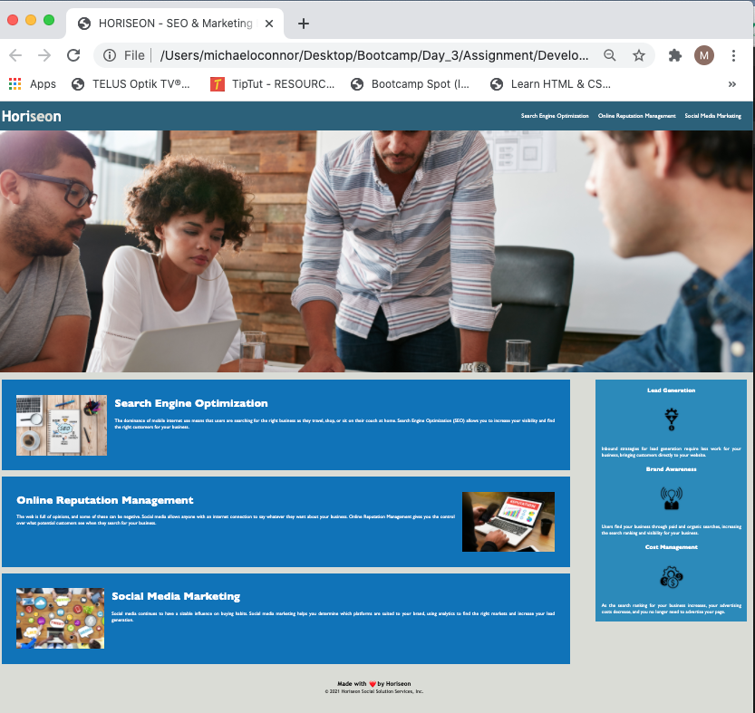

# Assignment01

# 01 HTML CSS Git: Code Refactor Assignment

Horiseon - Most recent updates, January 15, 2021, Michael O'Connor, WebDev Wannabe, 604 765-6061

**Note**: The Goal of this most recent update of the HTML and CSS was to improve accesibility without changing the functionality of the Horiseon site, I have also provided a list of potential future revisions at the end of this README file for future enhancements.  We have applied the W3C Web Content Accessibility Guidelines https://www.w3.org/WAI/ where it was practicalble to do so within the update. 

# 02 Updates Made:

    1. The title Element was changed to highlight what Horiseon does while user view the page.

    2. For all images, alt attributes were added to ensure that if images broke they could be more easily identified and traced, as a standard I have used the actual file names to facilitate searches.

    3. Line-heights and justification were adjusted for content. The default line height in browsers is at roughly 1.2. According to the Web Content Accessibility Guidelines it should be at least 1.5 within paragraphs in blocks of text [source: https://medium.com/@matuzo/writing-css-with-accessibility-in-mind-8514a0007939].

    4. I refreshed the copyright to 2021, in accordance with Canadian copyright.

    5. I have added some commenting in the CSS file to make it easier to follow and identify the last update.

    6. Adjusted spacing in the sidebar to make it more visually appealing.

    7. I have also reordered the flow of the CSS so that it follws a logical left to right reading pattern and added comments on what each area does.

# 03 Testing:

    1. I have tested each link to confirm functionality.

    2. HTML Code has been formatted to make it easier to follow when viewed at source.

    3. I have loaded the files and tested the page functionality at GITHUB.

# 04 Future Enhancements:

The following items should be considered for future enhancements, time and budget permitting:

    1. Line 58 of the CSS contains an image, that only appears at the top of the page.  Unless it is a full background-image, consider moving this to the HTML file.   

    2. Consider testing the contrast of the page to improve accessibility.  According to the World Health Organization about 4% of the population are visually impaired. 7 to 12% of men and less than 1% of women have some form of color-vision deficiency. Many of those impairments reduce sensitivity to contrast, and in some cases the ability to distinguish colors [source: https://medium.com/@matuzo/writing-css-with-accessibility-in-mind-8514a0007939].

    3. The Horiseon logo should have a link to the page itself to allow for quick refreshes. 

    4. Further work is required to ensure responsiveness to other devices.  The use of absolute positioned sidebar in relation to the section should be considered.

# 05 Current Rendering:

See Current Rendering at the time of writing in the Assignment01 Repo. 
